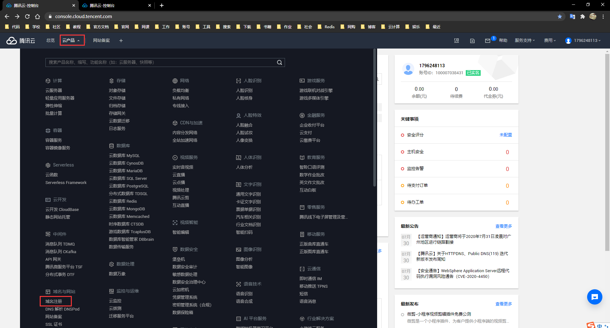
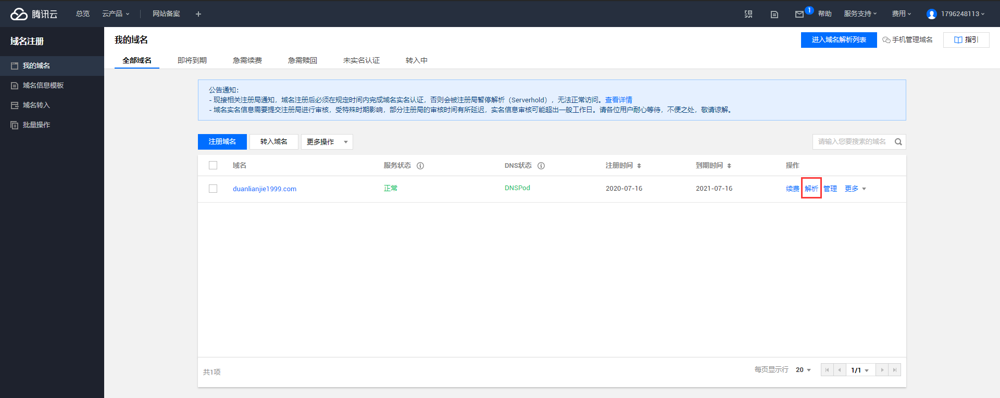
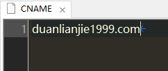

# 将Github pages部署的静态网页绑定个人域名


[TOC]

# 将Github pages部署的静态网页绑定个人域名

## 一. 域名解析服务商配置

**以腾讯云为例**

### 1. 控制台 —— 云产品 —— 域名注册



### 2. 我的域名 —— 解析



### 3. 添加记录

添加A记录或者CNAME记录任一即可

- 添加CNAME记录

```
@   CNAME   username.github.io
```

- 添加A记录

```
@   A   192.30.252.153
@   A   192.30.252.154
```

### 4. 等待DNS配置生效

- 大概10分钟


## 二. Github pages配置

## 2.1 CNAME配置

- 在静态网页的代码仓添加一个CNAME文件，并将自己的域名添加进去



## 2.2 启用HTTPS

- 自 2018 年 5 月 1 日，Github支持自定义域名的 HTTPS 请求了。
- 

## 三. 其他

- 绑定后可以通过不同域名访问同一个网站
