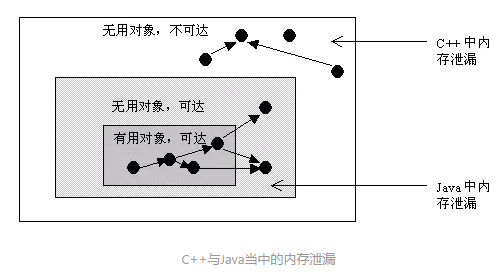
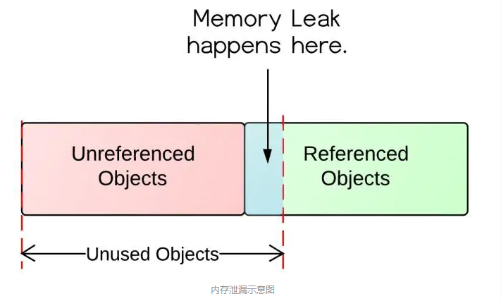

# 面试题


[TOC]

# String

- String为什么是final类型的？

  - final修饰的类是不被能继承的，所以final修饰的类是不能被篡改的。

  - 原因
    - 为了实现字符串池
      - 只有当字符串是不可变的，字符串池才有可能实现。
    - 为了线程安全
      - 同一个字符串实例可以被多个线程共享。这样便不用因为线程安全问题而使用同步。字符串自己便是线程安全的。
    - 为了实现String可以创建HashCode不可变性
      - 因为字符串是不可变的，所以在它创建的时候HashCode就被缓存了，不需要重新计算。这就使得字符串很适合作为Map中的键，字符串的处理速度要快过其它的键对象。这就是HashMap中的键往往都使用字符串的原因。
    - 为了安全问题
      - 字符串的不可变性避免了数据库的安全漏洞

# 内存泄漏

## Java内存泄漏

- 内存泄漏：对象是无用但是可达的，垃圾回收器没办法移除它们，因为还在被引用着，从而造成内存空间的浪费称为内存泄漏。

- 在Java中，内存泄漏就是存在一些被分配的对象，这些对象有下面两个特点：

  - 首先，这些对象是可达的，即在有向图中，存在通路可以与其相连；
  - 其次，这些对象是无用的，即程序以后不会再使用这些对象。
  - 如果对象满足这两个条件，这些对象就可以判定为Java中的内存泄漏，这些对象不会被GC所回收，然而它却占用内存。

  - 
  - 
    - 无用对象不全是未被引用对象。其中还有被引用的。就是这种情况导致了内存泄漏。

- 在Java中，判断一个内存空间是否符合垃圾收集的标准有两个：

  - 一个是给对象赋予了空值null，以下再没有调用过。
  - 一个是给对象赋予了新值，这样重新分配了内存空间。

## Java内存泄漏的场景

- 长生命周期的对象持有短生命周期对象的引用就很可能发生内存泄漏，尽管短生命周期对象已经不再需要，但是**因为长生命周期持有它的引用而导致不能被回收，这就是Java中内存泄漏的发生场景**。

### 1.静态集合类引起内存泄漏

像HashMap、Vector等的使用最容易出现内存泄露，这些静态变量的生命周期和应用程序一致，他们所引用的所有的对象Object也不能被释放，因为他们也将一直被Vector等引用着。

```java
static Vector v = new Vector(10);

for (int i = 0; i < 100; i++) {
    Object o = new Object();
    v.add(o);
    o = null;
}
```

### 2.监听器

在Java编程中，通常一个应用当中会用到很多监听器。通过调用一个控件的诸如addXXXListener()等方法来增加监听器，但往往在释放对象的时候却没有记住去删除这些监听器，从而增加了内存泄漏的机会。

### 3.各种连接

- 比如数据库连接，网络连接和IO连接，除非其显式的调用了其close()方法将其连接关闭，否则是不会自动被GC回收的。
  - 对于Resultset和Statement对象可以不进行显式回收，但Connection一定要显式回收，因为Connection在任何时候都无法自动回收，而Connection一旦回收，Resultset 和Statement对象就会立即为NULL。
  - 但是如果使用连接池，情况就不一样了，除了要显式地关闭连接，还必须显式地关闭Resultset Statement对象（关闭其中一个，另外一个也会关闭），否则就会造成大量的Statement对象无法释放，从而引起内存泄漏。这种情况下一般都会在try里面进行连接，在finally里面释放连接。

### 4.内部类和外部模块的引用

- 内部类的引用是比较容易遗忘的一种，而且一旦没释放可能导致一系列的后继类对象没有释放。

- 外部模块不经意的引用，例如程序员A负责A模块，调用了B模块的一个方法：

  ```java
  public void registerMsg(Object b);
  ```

  - 这种调用传入了一个对象，很可能模块B就保持了对该对象的引用，这时候就需要注意模块B是否提供相应的操作去除引用。

### 5.单例模式

单例对象在初始化后将在JVM的整个生命周期中存在（以静态变量的方式）。

如果单例对象持有外部的引用，那么这个对象将不能被JVM正常回收，导致内存泄漏。

考虑下面的例子：

```java
public class A {
    public A() {
        B.getInstance().setA(this);
    }
    ...
}

//B类采用单例模式
class B{
    private A a;
    private static B instance = new B();
    
    public B(){}
    
    public static B getInstance() {
        return instance;
    }
    
    public void setA(A a) {
        this.a = a;
    }

    public A getA() {
        return a;
    }
}
```


