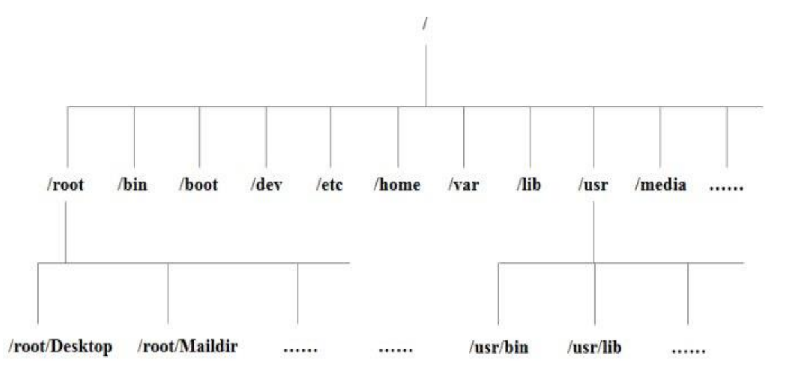
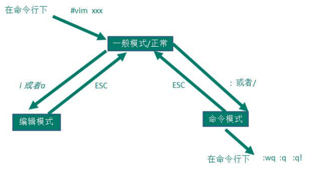
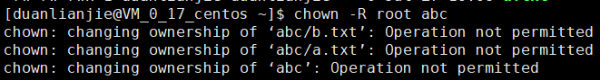
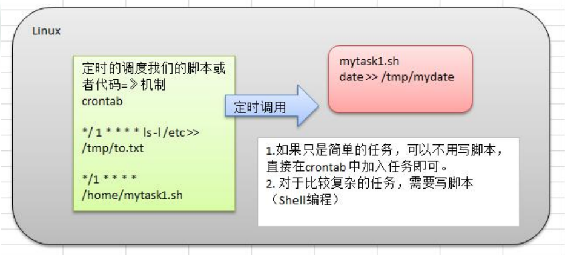
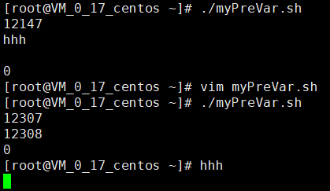

# Linux


[TOC]

# 第4章 基础篇 Linux的目录结构

## 4.1 基本介绍

- linux的文件系统是采用级层式的树状目录结构，在此结构中的最上层是根目录“/”，然后在此目录下再创建其他的目录。
- **在Linux世界里，一切皆文件。**



## 4.2 目录结构的具体介绍

- **/bin**(/usr/bin 、 /usr/local/bin)
  - 是Binary的缩写, 这个目录存放着最经常使用的命令。
- **/home**
  - 存放普通用户的主目录，在Linux中每个用户都有一个自己的目录，一般该目录名是以用户的账号命名的。
- **/root**
  - 该目录为系统管理员，也称作超级权限者的用户主目录。
- **/etc**
  - 所有的系统管理所需要的配置文件和子目录，比如my.conf。
- **/usr**
  - 这是一个非常重要的目录，用户的很多应用程序和文件都放在这个目录下，类似与 windows下的program files目录。
- **/boot**
  - 存放的是启动Linux时使用的一些核心文件，包括一些连接文件以及镜像文件。
- **/dev**
  - 类似于windows的设备管理器，把所有的硬件用文件的形式存储。
- **/media**
  - linux系统会自动识别一些设备，例如U盘、光驱等等，当识别后，linux 会把识别的设备挂载到这个目录下。
- **/mnt**
  - 系统提供该目录是为了让用户临时挂载别的文件系统的，我们可以将外部的存储挂载在/mnt/上，然后进入该目录就可以查看里的内容了。
- **/usr/local**
  - 这是另一个给主机额外安装软件所**安装的目录**。一般是通过编译源码方式安装的程序。
- **/var**
  - 这个目录中存放着在不断扩充着的东西，习惯将经常被修改的目录放在这个目录下。包括各种日志文件。
- /opt
  - 这是给主机额外**安装软件**所摆放的目录。如安装ORACLE数据库就可放到该目录下。默认为空。
- /selinux [security-enhanced linux] 360
  - SELinux是一种安全子系统,它能控制程序只能访问特定文件。
- /tmp
  - 这个目录是用来存放一些临时文件的。
- /sbin (/usr/sbin 、 /usr/local/sbin)
  - s就是Super User的意思，这里存放的是系统管理员使用的系统管理程序。
- /lib
  - 系统开机所需要最基本的动态连接共享库，其作用类似于Windows里的DLL文件。几 乎所有的应用程序都需要用到这些共享库。
- /lost+found
  - 这个目录一般情况下是空的，当系统非法关机后，这里就存放了一些文件。
- /proc
  - 这个目录是一个虚拟的目录，它是系统内存的映射，访问这个目录来获取系统信息。
- /srv
  - service缩写，该目录存放一些服务启动之后需要提取的数据。
- /sys
  - 这是linux2.6内核的一个很大的变化。该目录下安装了2.6内核中新出现的一个文件系统 sysfs。

# 第6章 实操篇 vi和vim编辑器

## 6.1 vi和vim的基本介绍

所有的 Linux 系统都会内建 vi 文本编辑器。

vim 具有程序编辑的能力，可以看做是 **vi 的增强版本**，可以主动的以字体颜色辨别语法的正确性，方便程序设计、代码补全、编译及错误跳转等方便编程的功能特别丰富，在程序员中被广泛使用。

## 6.2 vi 和 vim 的三种常见模式

- 正常模式
  - 在该模式下，可以使用快捷键。 
  - 以 vim 打开一个档案就直接进入正常模式了(这是默认的模式)。在这个模式中，你可以使用『上 下左右』按键来移动光标，你可以使用『删除字符』或『删除整行』来处理档案内容， 也可以使用 『复制、粘贴』来处理你的文件数据。
- 编辑模式 / 插入模式
  - 在该模式下，可以输入内容。
  - 按下 i, I, o, O, a, A, r, R 等任何一个字母之后才会进入编辑模式, 一般来说按 i 即可
- 命令模式
  - 在该模式下，可以提供你相关指令，完成读取、存盘、替换、离开 vim 、显示行号等的动作

## 6.3 vi 和 vim 三种模式的相互转化图



## 6.4 常用快捷键

- 正常模式
  - 拷贝当前行：yy
  - 拷贝当前行向下的 5 行：5yy
  - 粘贴：p
  - 删除当前行：dd
  - 删除当前行向下的 5 行：5dd
  - 定位文档的最末行：G
  - 定位文档的最首行：gg
  - 撤销：u
  - 光标移动到 第 20 行
    - 输入20这个数
    - shift+g
  
- 命令模式

  - wq：保存并退出
  - q!：不保存并强制退出
  - q：没有修改才能退出

  - 在文件中查找某个单词：[:]/关键字 
    - 输入 n 就是查找下一个
  - 显示文件的行号，取消文件的行号：:set nu 和 :set nonu

## 6.5 vim 和 vi 的快捷键键盘一览图


# 第7章 实操篇 开机、重启和用户登录注销

## 7.1 关机和重启

- shutdown 
  - shutdown -h now : 立即关机
  - shutdown -h 1 : 1 分钟后关机
  - shutdown -r now : 立即重启
- halt 就是直接使用，效果等价于关机
- reboot 就是重启系统
- sync ： 把内存的数据同步到磁盘

> 当我们关机或者重启时，都应该先执行以下 sync 指令，把内存的数据写入磁盘，防止数据丢失。

## 7.2 用户登录和注销

- 注销用户：logout
  - logout 注销指令在图形运行级别无效，在运行级别 3 下有效
- 切换身份：su - 用户名

# 第8章 实操篇 用户管理 

## 8.1 基本介绍

- Linux 系统是一个多用户多任务的操作系统，任何一个要使用系统资源的用户，都必须首先向系统管理员申请一个账号，然后以这个账号的身份进入系统。

- Linux 的用户需要至少要属于一个组。

## 8.2 用户相关基本指令

- 添加用户
  - useradd 用户名
- 添加用户并指定家目录，家目录需要未创建
  - useradd -d 目录 用户名
- 删除用户
  - userdel 用户名
- 删除用户以及家目录
  - userdel -r 用户名
- 指定或修改密码
  - passwd 用户名
- 查询用户信息
  - id 用户名
  - 用户id 组id 组名：uid=1000(duanlianjie) gid=1000(duanlianjie) groups=1000(duanlianjie)
- 切换用户
  - su - 用户名
- 退回到原用户
  - exit

## 8.3 用户组相关指令

- 添加组
  - groupadd 组名
- 删除组
  - groupdel 组名
- 添加用户并指定组
  - useradd -g 用户组 用户名


- ls -lh /home
  - h：human

# 第10章 实操篇 组管理和权限管理 

- chown
  - 普通用户没有权限




# 第11章 实操篇 crond 任务调度

## 11.1 原理示意图



## 11.2 概述

- 任务调度：是指系统在某个时间执行的特定的命令或程序。 
- 任务调度分类：
  - 1.系统工作：有些重要的工作必须周而复始地执行。如病毒扫描等。
  - 2.个别用户工作：个别用户可能希望执行某些程序。如对mysql数据库的备份。

# 第14章 实操篇 进程管理

## 14.5 服务管理 *

# 查看Linux发行版的名称及其版本号

- 查看Linux内核版本
  - cat /proc/version
  - uname -a
- 查看Linux系统版本的命令
  - cat /etc/redhat-release
    - 适用于RedHat系的Linux
  - lsb_release -a
    - 适用于所有的Linux发行版，包括RedHat、SuSE、Debian…等发行版。
  - cat /etc/issue
    - 适用于所有的Linux发行版

# 第15章 JavaEE定制篇 搭建JavaEE环境

- 配置环境变量后 source /etc/profile

# 第17章 大数据定制篇 Shell编程

## 预定义变量

- 后台和不后台的区别

```bash
#!/bin/bash
#myShell.sh
echo "hhh"
```


```bash
#!/bin/bash
#myPreVar.sh
echo "$$"
./myShell.sh [&]
echo "$!"
echo "$?"
```



## 自定义函数

- 函数名后面小括号可选
