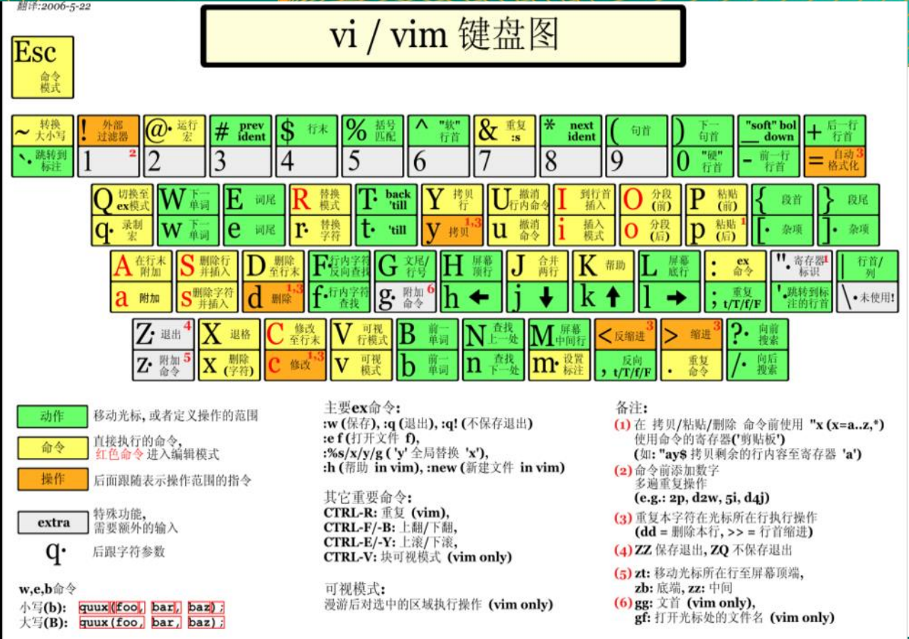

# Linux


[TOC]

# 第 1 章 开山篇 Linux 学习介绍

## 1.1 Linux 的学习方向

- Linux 运维工程师
- Linux 嵌入式开发工程师
- 在 Linux 下做各种程序开发

## 1.2 Linux 的应用领域

### 1.2.1 个人桌面应用领域

- 传统 linux 应用最薄弱的环节。
  - 传统 linux 由于界面简单、操作复杂、应用软件少的缺点， 一直被 windows 所压制，但近些年来随着 ubuntu、fedora 等优秀桌面环境的兴起，同时各大硬件厂商对其支持的加大，linux 在个人桌面领域的占有率在逐渐的提高。

### 1.2.2 服务器应用领域

- linux 在服务器领域的应用是最强的。
  - linux 免费、稳定、高效等特点在这里得到了很好的体现，近些年来 linux 服务器市场得到了飞速的提升，尤其在一些高端领域尤为广泛。

### 1.2.3 嵌入式应用领域

- 近些年来 linux 在嵌入式领域的应用得到了飞速的提高
  - linux 运行稳定、对网络的良好支持性、低成本，且可以根据需要进行软件裁剪，内核最小可以达到几百 KB 等特点，使其近些年来在嵌入式领域的应用得到非常大的提高。
  - 主要应用：机顶盒、数字电视、网络电话、程控交换机、手机、PDA、智能家居、智能硬件等都 是其应用领域。以后再物联网中应用会更加广泛。

## 1.3 学习 Linux 的阶段

- 第 1 阶段：linux 环境下的基本操作命令，包括文件操作命令(rm mkdir chmod, chown)，编辑工具使用（vi vim），linux 用户管理(useradd userdel usermod)等。
- 第 2 阶段：linux 的各种配置（环境变量配置，网络配置，服务配置）。
- 第 3 阶段：linux 下如何搭建对应语言的开发环境（大数据，JavaEE, Python 等）。
- 第 4 阶段：能编写 shell 脚本，对 Linux 服务器进行维护。
- 第 5 阶段：能进行安全设置，防止攻击，保障服务器正常运行，能对系统调优。
- 第 6 阶段：深入理解 Linux 系统（对内核有研究），熟练掌握大型网站应用架构组成、并熟悉各个环节的部署和维护方法。

# 第 2 章 基础篇 Linux 入门

## 2.1 Linux 介绍

(1) Linux 是一款操作系统，免费，开源，安全，高效，稳定，处理高并发非常强悍，现在很多的企业级的项目都部署到 Linux/Unix 服务器运行。

(2) Linux 创始人


(3) Linux 的主要的发行版


## 2.2 UNIX GNU Linux的关系

## 2.3 Linux和Windows比较

# 第 3 章 基础篇 VM 和 Linux 系统(CentOS)安装

## 3.1 安装 vm 和 Centos

## 3.2 VM 安装的步骤

（1） 去 BIOS 里修改设置开启虚拟化设备支持（f2, f10） 

（2）安装虚拟机软件

## 3.3 CentOS 安装的步骤

- 网络连接模式
    - 桥连接：Linux 可以和其它的系统通信，但是可能造成ip冲突

    - NAT：网络地址转换方式，linux可以访问外网，不会造成ip冲突

    - 主机模式：你的 linux 是一个独立的主机，不能访问外网

## 3.4 vmtools 安装

### 3.6.1 介绍

1)可以直接粘贴命令在 windows 和 centos 系统之间

2)可以设置 windows 和 centos 的共享文件夹

### 3.6.2 安装 vmtools 的步骤

1.进入 centos

2.点击 vm 菜单的->install vmware tools

3.centos 会出现一个 vm 的安装包

4.点击右键解压, 得到一个安装文件

5.进入该 vm 解压的目录 ，该文件在 /root/桌面/vmware-tools-distrib/下

6.安装 ./vmware-install.pl

7.全部使用默认设置即可

8.需要 reboot 重新启动即可生效

### 3.6.3 使用 vmtools 来设置 windows 和 linux 的共享文件夹

虚拟机->设置->选项->共享文件夹

# 第 4 章 基础篇 Linux 的目录结构

## 4.1 基本介绍

- linux的文件系统是采用级层式的树状目录结构，在此结构中的最上层是根目录“/”，然后在此目录下再创建其他的目录。
- **在Linux世界里，一切皆文件。**


## 4.2 目录结构的具体介绍

- **/bin**(/usr/bin 、 /usr/local/bin)
  - 是Binary的缩写, 这个目录存放着最经常使用的命令。
- /sbin (/usr/sbin 、 /usr/local/sbin)
    - s就是Super User的意思，这里存放的是系统管理员使用的系统管理程序。
- **/home**
  - 存放普通用户的主目录，在Linux中每个用户都有一个自己的目录，一般该目录名是以用户的账号命名的。
- **/root**
  - 该目录为系统管理员，也称作超级权限者的用户主目录。
- **/etc**
  - 所有的系统管理所需要的配置文件和子目录，比如my.conf。
- **/usr**
  - 这是一个非常重要的目录，用户的很多应用程序和文件都放在这个目录下，类似与 windows下的program files目录。
- **/boot**
  - 存放的是启动Linux时使用的一些核心文件，包括一些连接文件以及镜像文件。
- **/dev**
  - 类似于windows的设备管理器，把所有的硬件用文件的形式存储。
- **/media**
  - linux系统会自动识别一些设备，例如U盘、光驱等等，当识别后，linux 会把识别的设备挂载到这个目录下。
- **/mnt**
  - 系统提供该目录是为了让用户临时挂载别的文件系统的，我们可以将外部的存储挂载在/mnt/上，然后进入该目录就可以查看里的内容了。
- **/usr/local**
  - 这是给主机额外安装软件所**安装的目录**。一般是通过编译源码方式安装的程序。
- **/var**
  - 这个目录中存放着在不断扩充着的东西，习惯将经常被修改的目录放在这个目录下。包括各种日志文件。
- /opt
  - 这是给主机额外**安装软件**所摆放的目录。如安装ORACLE数据库就可放到该目录下。默认为空。
- /selinux [security-enhanced linux] 360
  - SELinux是一种安全子系统,它能控制程序只能访问特定文件。
- /tmp
  - 这个目录是用来存放一些临时文件的。
- /lib
  - 系统开机所需要最基本的动态连接共享库，其作用类似于Windows里的DLL文件。几乎所有的应用程序都需要用到这些共享库。
- /lost+found
  - 这个目录一般情况下是空的，当系统非法关机后，这里就存放了一些文件。
- /proc
  - 这个目录是一个虚拟的目录，它是系统内存的映射，访问这个目录来获取系统信息。
- /srv
  - service缩写，该目录存放一些服务启动之后需要提取的数据。
- /sys
  - 这是linux2.6内核的一个很大的变化。该目录下安装了2.6内核中新出现的一个文件系统 sysfs。

# 第 5 章 实操篇 远程登录 Linux 系统

## 5.1 为什么需要远程登录 Linux

- 公司开发时候， 具体的情况是这样的：
    - linux 服务器是开发小组共享的，正式上线的项目是运行在公网的，因此程序员需要远程登录到 centos 进行项目管理或者开发

## 5.2 远程登录 Xshell

Xshell是一个强大的安全终端模拟软件，它支持 SSH1, SSH2, 以及 Microsoft Windows 平台的 TELNET 协议。

**特别说明**：如果希望安装好 XShell就可以远程访问 Linux 系统的话，需要有一个前提，就是 Linux 启用了 SSHD 服务，该服务会监听 22 号端口。

## 5.3 远程上传下载文件 Xftp

# 第 6 章 实操篇 vi 和 vim 编辑器

## 6.1 vi和vim的基本介绍

所有的 Linux 系统都会内建 vi 文本编辑器。

vim 具有程序编辑的能力，可以看做是 **vi 的增强版本**，可以主动的以字体颜色辨别语法的正确性，方便程序设计、代码补全、编译及错误跳转等方便编程的功能特别丰富，在程序员中被广泛使用。

## 6.2 vi 和 vim 的三种常见模式

- 正常模式
  - 在该模式下，可以使用快捷键。 
  - 以 vim 打开一个档案就直接进入正常模式了(这是**默认的模式**)。在这个模式中，你可以使用『上下左右』按键来移动光标，你可以使用『删除字符』或『删除整行』来处理档案内容， 也可以使用 『复制、粘贴』来处理你的文件数据。
- 编辑模式 / 插入模式
  - 在该模式下，可以输入内容。
  - 按下 i, I, o, O, a, A, r, R 等任何一个字母之后才会进入编辑模式, 一般来说按 i 即可
- 命令模式
  - 在该模式下，可以提供你相关指令，完成读取、存盘、替换、离开 vim 、显示行号等的动作

## 6.3 vi 和 vim 三种模式的相互转化图


## 6.4 常用快捷键

- 正常模式
  - 拷贝当前行：yy
  - 拷贝当前行向下的 5 行：5yy
  - 粘贴：p
  - 删除当前行：dd
  - 删除当前行向下的 5 行：5dd
  - 定位文档的最末行：G
  - 定位文档的最首行：gg
  - 撤销：u
  - 光标移动到 第 20 行
    - 输入20这个数
    - shift+g
  - 在文件中查找某个单词：/关键字 
      - 输入 n 就是查找下一个
  
- 命令模式

  - wq：保存并退出
  - q!：不保存并强制退出
  - q：没有修改才能退出

  - 在文件中查找某个单词：:/关键字 
    - 输入 n 就是查找下一个
  - 显示文件的行号，取消文件的行号：:set nu 和 :set nonu

## 6.5 vim 和 vi 的快捷键键盘一览图



# 第 7 章 实操篇 开机、重启和用户登录注销

## 7.1 关机和重启

- shutdown 
  - shutdown -h now : 立即关机
  - shutdown -h 1 : 1 分钟后关机
  - shutdown -r now : 立即重启
- halt 就是直接使用，效果等价于关机
- reboot 就是重启系统
- sync ： 把内存的数据同步到磁盘

    - 当我们关机或者重启时，都应该先执行以下 sync 指令，把内存的数据写入磁盘，防止数据丢失。

## 7.2 用户登录和注销

- 注销用户：logout
  - logout 注销指令在图形运行级别无效，在运行级别 3 下有效
- 切换身份：su - 用户名
    - 切换root：su - [root]

# 第 8 章 实操篇 用户管理 

## 8.1 基本介绍

- Linux 系统是一个多用户多任务的操作系统，任何一个要使用系统资源的用户，都必须首先向系统管理员申请一个账号，然后以这个账号的身份进入系统。

- Linux 的用户需要至少要属于一个组。

## 8.2 用户相关基本指令

- useradd 用户名
    - 添加用户
    - Ubuntu 20.04 LTS不会自动创建家目录，Cent OS 7会自动创建家目录
- useradd -d 目录 用户名
    - 添加用户并指定家目录，家目录需要未创建
- userdel 用户名
    - 删除用户
- userdel -r 用户名
    - 删除用户以及家目录
- passwd 用户名
    - 指定或修改密码
- id 用户名
    - 查询用户信息
    - 用户id 组id 组名：uid=1000(duanlianjie) gid=1000(duanlianjie) groups=1000(duanlianjie)
- su 用户名
    - 不改变当前变量，只能使用exit退回
- su - 用户名
    - 改变为切换到用户的变量，可以使用logout退回
- exit
  - 退回到原用户

### 8.2.1 su 和 su - 的区别

- duanlianjie 登录


- su 切换
    - su 只能获得root的执行权限，不能获得环境变量


- su - 切换
    - su - 切换到root并获得root的环境变量及执行权限
    - “-” 会进入一个login shell，即和该用户登录的情况完全一样


### 8.2.1 su 和 sudo 的区别

- sudo
    - 通过 sudo，能把某些超级权限有针对性的下放，并且不需要普通用户知道 root 密码，所以 sudo 相对于权限无限制性的 su 来说，还是比较安全的。
    - 所以 sudo 也能被称为受限制的su；另外 sudo 是需要授权许可的，所以也被称为授权许可的su。
    - sudo 执行命令的流程是当前用户切换到 root（或其它指定切换到的用户），然后以 root（或其它指定的切换到的用户）身份执行命令，执行完成后，直接退回到当前用户；而这些的前提是要通过sudo的配置文件/etc/sudoers来进行授权。
    - 特性
        - sudo 能够限制用户只在某台主机上运行某些命令。
        - sudo 提供了丰富的日志，详细地记录了每个用户干了什么。它能够将日志传到中心主机或者日志服务器。
        - sudo 使用时间戳文件来执行类似的“检票”系统。当用户调用sudo并且输入它的密码时，用户获得了一张存活期为5分钟的票（这个值可以在编译的时候改变）。
        - sudo 的配置文件是 sudoers 文件，它允许系统管理员集中的管理用户的使用权限和使用的主机。它所存放的位置默认是在 /etc/sudoers，属性必须为0411。
- 密码：
    - sudo 命令需要输入当前用户的密码，su 命令需要输入 root 用户的密码。
- 默认行为：
    - sudo 命令只允许使用提升的权限运行单个命令，而 su 命令会启动一个新的 shell，同时允许使用 root 权限运行尽可能多的命令，直到明确退出登录。
- 日志记录
    - sudo 命令是以目标用户（默认情况下是 root 用户）的身份执行命令，但是它们会使用 sudoer 所配置的用户名来记录是谁执行命令。而 su 命令是无法直接跟踪记录用户切换到 root 用户之后执行了什么操作。
- 灵活性
    - sudo 命令比 su 命令灵活很多，因为你甚至可以限制 sudo 用户可以访问哪些命令。换句话说，用户通过 sudo 命令只能访问他们工作需要的命令。而 su 命令让用户有权限做任何事情。
- 使用 su 命令或直接以 root 用户身份登录有风险，所以一些 Linux 发行版（如 Ubuntu）默认禁用 root 用户帐户。鼓励用户在需要 root 权限时使用 sudo 命令。

## 8.3 用户组相关指令

- groupadd 组名
- 添加组
- groupdel 组名
- 删除组
- useradd -g 用户组 用户名
    - 添加用户并指定组
- usermod -g 用户组 用户名
    - 修改用户的组

## 8.4 用户和用户组配置文件

### 8.4.1 /etc/passwd 文件

- 用户的配置文件，记录用户的各种信息
- 每行的含义：用户名:口令:用户标识号:组标识号:注释性描述:主目录:登录 Shell


### 8.4.2 /etc/shadow 文件

- 口令的配置文件
- 每行的含义：登录名:加密口令:最后一次修改时间:最小时间间隔:最大时间间隔:警告时间:不活动时间:失效时间:标志


### 8.4.3 /etc/group 文件

- 组(group)的配置文件，记录 Linux 包含的组的信息
- 每行的含义：组名:口令:组标识号:组内用户列表


# 第 9 章 实操篇 实用指令

## 9.1 运行级别

- **init**（为英语：initialization的简写）是 Unix 和 类Unix 系统中用来产生其它所有进程的程序。它以守护进程的方式存在，其进程号为1。
- Linux系统在引导时加载Linux内核后，便由Linux内核加载init程序，由init程序完成余下的引导过程，比如加载运行级别，加载服务，引导Shell/图形化界面等等。

- init的发展变化
    - System V
        - System V init检查 '/etc/inittab' 文件中是否含有 'initdefault' 项。这告诉init系统是否有一个默认运行模式。如果没有默认的运行模式，那么用户将进入系统控制台，手动决定进入何种运行模式。
    - Upstart
        - 完全代替 init ，可以异步开启进程，曾由Ubuntu等使用
    - systemd
        - 完全替代init，可并行启动服务，并能减少在shell上的系统开销，相比传统的System V是一大革新，已被大多数Linux发行版所使用

### 9.1.1 System V

- 运行级别说明：
    - 0：关机
    - 1：单用户【找回丢失密码】
    - 2：多用户状态无网络服务
    - 3：多用户状态有网络服务
    - 4：系统未使用保留给用户
    - 5：图形界面
    - 6：系统重启
- 常用运行级别是 3 和 5 ，要修改默认的运行级别可改文件 /etc/inittab 的 id:5:initdefault:这一行中的数字

### 9.1.2 systemd

- systemd是Linux电脑操作系统之下的一套中央化系统及设置管理程序，包括有守护进程、程序库以及应用软件。
- inittab is no longer used when using **systemd**. systemd uses “targets” instead of runlevels. By default, there are two main targets:
    - multi-user.target: analogous to runlevel 3
    - graphical.target: analogous to runlevel 5
- systemctl get-default：查看当前target
- systemctl set-default multi-user.target/graphical.target：设置target

## 9.2 运行级别相关指令

- init [012356]
    - 切换到指定运行级别

### 9.2.1 找回root密码

- 进入到 单用户模式，然后修改 root 密码。因为进入单用户模式，root 不需要密码就可 以登录。
- 开机 -> 在引导时输入 回车键 -> 看到一个界面输入 e -> 看到一个新的界面，选中第二行（编辑内核）再输入 e -> 在这行最后输入 1 ,再输入 回车键 -> 再次输入 b -> 这时就会进入到单用户模式。
- 这时，我们就进入到单用户模式，使用 passwd 指令来修改 root 密码。

## 9.3 帮助指令

- man [命令或配置文件]
    - 获得帮助信息
- help 命令
    - 获得 shell 内置命令的帮助信息

## 9.4 文件目录类

- pwd
    - 显示当前工作目录的绝对路径
- ls [选项] [目录或文件]
    - -a ：显示当前目录所有的文件和目录，包括隐藏的
    - -l ：以列表的方式显示信息
    - -h：human，易读的方式显示信息
- cd [目录]
    - 切换到指定目录
    - cd ~ 或者 cd ：回到自己的家目录
    - cd .. 回到当前目录的上一级目录
- mkdir [选项] 要创建的目录
    - -p ：创建多级目录
- rmdir [选项] 要删除的空目录
    - 删除的是空目录，如果目录下有内容时无法删除的
- rm [选项] 要删除的文件或目录
    - 删除文件或目录
    - -r ：递归删除整个文件夹
    - -f ： 强制删除不提示
- touch 文件名称1 ...
    - 创建空文件
- **cp** [选项] source dest
    - 拷贝文件或文件夹到指定目录下
    - -r ：递归复制整个文件夹
    - 当目标目录有同名文件，强制覆盖不提示的方法：\cp ......
- mv oldNameFile newNameFile
    - 重命名
- mv File Folder
    - 移动文件
- cat [选项] 要查看的文件
    - 查看文件内容，是以只读的方式打开
    - -n ：显示行号
- more 要查看的文件
    - more 指令是一个基于 vi 编辑器的文本过滤器，它以全屏幕的方式按页显示文本文件的内容。
    - 快捷键
        - space：向下翻一页
        - Enter：向下翻一行
        - q：立刻离开more.不再显示该文件内容
        - Ctrl+F：向下滚动一屏
        - Ctrl+B
            返回上一屏
            =
            输出当前行的行号
            f
            输出文件名和当前行的行号

# 第10章 实操篇 组管理和权限管理 

- chown
  - 普通用户没有权限


# 第11章 实操篇 crond 任务调度

## 11.1 原理示意图


## 11.2 概述

- 任务调度：是指系统在某个时间执行的特定的命令或程序。 
- 任务调度分类：
  - 1.系统工作：有些重要的工作必须周而复始地执行。如病毒扫描等。
  - 2.个别用户工作：个别用户可能希望执行某些程序。如对mysql数据库的备份。

# 第 14 章 实操篇 进程管理

## 14.1 进程的基本介绍

1) 在 LINUX 中，每个执行的程序（代码）都称为一个进程。每一个进程都分配一个 ID 号。
2) 每一个进程，都会对应一个父进程，而这个父进程可以复制多个子进程。例如 www 服务器。
3)每个进程都可能以两种方式存在的。前台与后台，所谓前台进程就是用户目前的屏幕上可以进
行操作的。后台进程则是实际在操作，但由于屏幕上无法看到的进程，通常使用后台方式执行。
4)一般系统的服务都是以后台进程的方式存在，而且都会常驻在系统中。直到关机才才结束。

## 14.5 服务管理 *

# 查看Linux发行版的名称及其版本号

- 查看Linux内核版本
  - cat /proc/version
  - uname -a
- 查看Linux系统版本的命令
  - cat /etc/redhat-release
    - 适用于RedHat系的Linux
  - lsb_release -a
    - 适用于所有的Linux发行版，包括RedHat、SuSE、Debian…等发行版。
  - cat /etc/issue
    - 适用于所有的Linux发行版

# 第15章 JavaEE定制篇 搭建JavaEE环境

- 配置环境变量后 source /etc/profile

# 第17章 大数据定制篇 Shell编程

## 预定义变量

- 后台和不后台的区别

```bash
#!/bin/bash
#myShell.sh
echo "hhh"
```


```bash
#!/bin/bash
#myPreVar.sh
echo "$$"
./myShell.sh [&]
echo "$!"
echo "$?"
```


## 自定义函数

- 函数名后面小括号可选

# 第 18 章 Python 定制篇 开发平台 Ubuntu

## 18.1 Ubuntu 的介绍

- Ubuntu 是一个以桌面应用为主的开源 GNU/Linux 操作系统，Ubuntu 是基于 GNU/Linux，支持 x86、amd64（即 x64）和 ppc 架构，由全球化的专业开发团队（Canonical Ltd）打造的。
- 专业的 Python 开发者一般会选择 Ubuntu 这款 Linux 系统作为生产平台，而且 Ubuntu 安装时会自动安装 Python环境。

## 18.2 Ubuntu 的安装

### 18.2.1 安装的步骤

### 18.2.2 设置语言和输入源

- 1.设置语言
    - 设置 -> 区域与语言 -> 管理已安装的语言 -> 添加或删除语言 -> 中文简体 -> 应用 -> 拖到最上面 -> 重启
- 设置中文输入源
    - 设置 -> 区域与语言 -> 输入源 -> 添加输入源
    - 切换输入源
        - Shift + Super（WIN）+ 空格
        - Super（WIN）+ 空格

## 18.3 Ubuntu 的 root 用户

### 18.3.1 介绍

- 安装 ubuntu 成功后，都是普通用户权限，并没有最高 root 权限，如果需要使用 root 权限的时候，通常都会在命令前面加上 sudo 。
- 一般使用su命令来直接切换到root用户的，但是如果没有给root设置初始密码，就会抛出 su : Authentication failure 这样的问题。所以，我们只要给 root 用户设置一个初始密码就好了。

### 18.3.2 给 root 用户设置密码并使用

1) 输入 sudo passwd 命令，输入一般用户密码并设定 root 用户密码。

2) 设定 root 密码成功后，输入 su 命令，并输入刚才设定的 root 密码，就可以切换成 root 用户。

- 提示符$代表一般用户，提示符#代表 root 用户。

3) 输入 exit 命令，退出 root 并返回一般用户。

## 18.4 Ubuntu 下开发 Python

- 安装好 Ubuntu 后，默认就已经安装好 Python 的开发环境。

# 第 19 章 Python 定制篇 apt 软件管理和远程登录

## 19.1 apt 介绍

- apt 是 Advanced Packaging Tool 的简称，是一款安装包管理工具。
- 在 Ubuntu 下，apt 命令可用于软件包的安装、删除、清理等，类似于 Windows 中的软件管理工具。
- unbuntu 软件管理的原理示意图：


## 19.2 Ubuntu 软件操作的相关命令

- sudo apt-get update 更新源
- sudo apt-get install package 安装包
- sudo apt-get remove package 删除包
- sudo apt-cache search package 搜索软件包
- sudo apt-cache show package 获取包的相关信息，如说明、大小、版本等
- sudo apt-get install package --reinstall 重新安装包
- sudo apt-get -f install 修复安装
- sudo apt-get remove package --purge 删除包，包括配置文件等
- sudo apt-get build-dep package 安装相关的编译环境
- sudo apt-get upgrade 更新已安装的包
- sudo apt-get dist-upgrade 升级系统
- sudo apt-cache depends package 了解使用该包依赖那些包
- sudo apt-cache rdepends package 查看该包被哪些包依赖
- sudo apt-get source package 下载该包的源代码

## 19.3 更新 Ubuntu 软件下载地址

### 19.3.1 原理示意图


### 19.3.2 寻找国内镜像源

https://mirrors.tuna.tsinghua.edu.cn/help/ubuntu/

### 19.3.3 备份 Ubuntu 默认的源地址

```bash
sudo cp /etc/apt/sources.list /etc/apt/sources.list.backup
```

### 19.3.4 更新源服务器列表

```bash
sudo apt-get update
```

## 19.5 使用 SSH 远程登录 Ubuntu

### 19.5.1 SSH 介绍

- SSH 为 Secure Shell 的缩写，由 IETF 的网络工作小组（Network Working Group）所制定；SSH 为建立在应用层和传输层基础上的安全协议。SSH 是目前较可靠，专为远程登录会话和其他网络服务提供安全性的协议。常用于远程登录，以及用户之间进行资料拷贝。几乎所有 UNIX 平台—包括 HP-UX、Linux、AIX、Solaris、Digital UNIX、Irix，以及其他平台，都可运行 SSH。
- 使用 SSH 服务，需要安装相应的服务器和客户端。和 CentOS 不一样，Ubuntu 默认没有安装 SSHD 服务，因此，我们不能进行远程登录。

### 19.5.1 安装 SSH 和启用

- 执行如下指令后，在当前这台 Linux 上就安装了 SSH 服务端和客户端。

```bash
sudo apt-get install openssh-server
systemctl start sshd
```

- 从 Linux 系统客户机远程登陆 linux 系统服务机
    - ssh 用户名@IP
- 登出
    - exit 或者 logout

## 19.6 Ubuntu 注意问题

- /usr/bin/xauth:  timeout in locking authority file /home/xumin//.Xauthority
    - 使用新建用户xumin登录的错误提示？？？
