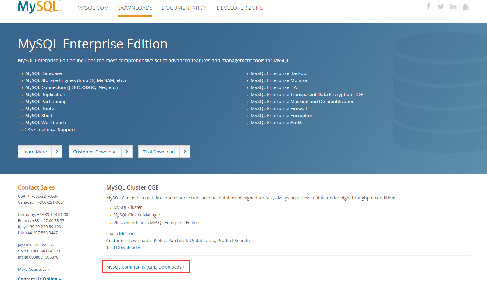

# MySQL 8.0 安装步骤


[TOC]

# MySQL 8.0 安装步骤

## MSI安装方式

### 1. 下载MSI文件

> 百度百科：MSI文件是Windows Installer的数据包，它实际上是一个数据库，包含安装一种产品所需要的信息和在很多安装情形下安装（和卸载）程序所需的指令和数据。

- 进入官网下载地址-[MySQL](https://www.mysql.com/downloads/)，点击下方的社区下载。
    - 不要点击上面的Customer Download或者Trial Download，会跳转到Oracle的网址，还要注册他们的账号进行登录，很麻烦。



- 点击MySQL Installer for Windows


- 下载MSI文件

### 2. 安装

- 点击MSI文件进行安装

### 3. 配置

- 在桌面新建`my.ini`配置文件，写入如下内容，然后移动到C:\Program Files\MySQL\MySQL Server 8.0

```toml
[mysql]

# 设置mysql客户端默认字符集
default-character-set=utf8

[mysqld]

# 设置3306端口
port = 3306

# 设置mysql的安装目录
basedir=C:\Program Files\MySQL

# 设置mysql数据库的数据的存放目录
datadir=C:\Program Files\MySQL\data

# 允许最大连接数
max_connections=20

# 服务端使用的字符集默认为8比特编码的latin1字符集
character-set-server=utf8

# 创建新表时将使用的默认存储引擎
default-storage-engine=INNODB
```

- C:\Program Files\MySQL\MySQL Server 8.0\bin目录下执行`.\mysqld.exe install`，安装MySQL服务
    - 在Program Files下执行命令需要以管理员身份运行命令行，先以管理员身份运行然后切到bin目录下
- C:\Program Files\MySQL\MySQL Server 8.0\bin目录下执行`.\mysqld.exe --initialize --console`，根据`my.ini`中的字段，创建一个系统数据库以及初始化数据文件目录。
    - 生成的随机root密码需要记住，否则没法登录MySQL
- C:\Program Files\MySQL\MySQL Server 8.0\bin目录下执行`net start mysql`，启动服务
- C:\Program Files\MySQL\MySQL Server 8.0\bin目录下执行`mysql -u root -p`，输入刚才的随机密码登录
- 设置新的密码

```mysql
ALTER USER 'root'@'localhost' identified with mysql_native_password by '<你的密码>';
```

### 4. 添加环境变量

- 把C:\Program Files\MySQL\MySQL Server 8.0\bin添加到系统环境变量PATH中即可

### 5. 测试

任意路径下开启命令行测试

- 管理员身份打开命令行，停止服务
    - `net stop mysql`
- 管理员身份打开命令行，启动服务
    - `net start mysql`
- 登录
    - `mysql -u root -p`

## 压缩包安装方式

在MSI安装方式上
