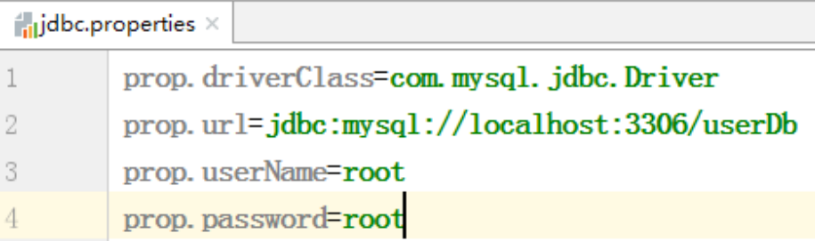

# Spring


[TOC]

# IOC

- BeanFactory 和 ApplicationContext

  - （1）BeanFactory：IOC容器基本实现，是Spring内部的使用接口，不提供开发人员进行使用
    - 加载配置文件时候不会创建对象，在获取对象（使用）才去创建对象
  - （2）ApplicationContext：BeanFactory 接口的子接口，提供更多更强大的功能，一般由开发人员进行使用
    - 加载配置文件时候就会把在配置文件对象进行创建
    - 使用这种方式的优点：把创建对象这种耗时耗资源的操作放在项目启动时进行处理更合适


## IOC 操作 Bean 管理

- DI是IOC的一种具体实现

## IOC 操作 Bean 管理（xml 注入其他类型属性）

### 1、字面量 

（1）null 值

```xml
<!--null 值-->
<property name="address">
	<null/>
</property>
```

（2）属性值包含特殊符号

```xml
<!--属性值包含特殊符号
 1 把<>进行转义 &lt; &gt;
 2 把带特殊符号内容写到 <![CDATA[xxxx]]
-->
<property name="address">
	<value><![CDATA[<<南京>>]]></value>
</property>
```

### 2、注入属性-外部 bean

（1）创建两个类 service 类和 dao 类

（2）在 service 调用 dao 里面的方法

（3）在 spring 配置文件中进行配置

```java
public class UserService {
	// 创建 UserDao 类型属性，生成 set 方法
 	private UserDao userDao;
	public void setUserDao(UserDao userDao) {
 		this.userDao = userDao;
	}
 	public void add() {
 		System.out.println("service add...");
 		userDao.update();
 	}
}
```

```xml
<!--1 service 和 dao 对象创建-->
<bean id="userService" class="com.atguigu.spring5.service.UserService">
 <!--注入 userDao 对象
 name 属性：类里面属性名称
 ref 属性：创建 userDao 对象 bean 标签 id 值
 -->
	<property name="userDao" ref="userDaoImpl"></property>
</bean>

<bean id="userDaoImpl" class="com.atguigu.spring5.dao.UserDaoImpl"></bean>
```


## IOC 操作 Bean 管理（xml 自动装配）

### 1、什么是自动装配 

（1）根据指定装配规则（属性名称或者属性类型），Spring 自动将匹配的属性值进行注入

### 2、自动装配过程 

（1）根据属性名称自动注入

```xml
<!--实现自动装配
 bean 标签属性 autowire：配置自动装配
 autowire 属性常用两个值：
 	byName 根据属性名称注入，注入值 bean 的 id 值和类属性名称一样
 	byType 根据属性类型注入
-->
<bean id="emp" class="com.atguigu.spring5.autowire.Emp" autowire="byName">
 <!--<property name="dept" ref="dept"></property>-->
</bean>

<bean id="dept" class="com.atguigu.spring5.autowire.Dept"></bean>
```

（2）根据属性类型自动注入

```xml
<!--实现自动装配
 bean 标签属性 autowire：配置自动装配
 autowire 属性常用两个值：
 	byName 根据属性名称注入 ，注入值 bean 的 id 值和类属性名称一样
 	byType 根据属性类型注入
-->
<bean id="emp" class="com.atguigu.spring5.autowire.Emp" autowire="byType">
 <!--<property name="dept" ref="dept"></property>-->
</bean>
<bean id="dept" class="com.atguigu.spring5.autowire.Dept"></bean>
```

## IOC 操作 Bean 管理（外部属性文件）

### 1、直接配置数据库连接池

（1）引入德鲁伊连接池依赖 jar 包

（2）配置德鲁伊连接池

```xml
<!--直接配置连接池-->
<bean id="dataSource" class="com.alibaba.druid.pool.DruidDataSource">
	<property name="driverClassName" value="com.mysql.jdbc.Driver"></property>
	<property name="url" value="jdbc:mysql://localhost:3306/userDb"></property>
 	<property name="username" value="root"></property>
 	<property name="password" value="root"></property>
</bean>
```

### 2、引入外部属性文件配置数据库连接池

（1）创建外部属性文件，properties 格式文件，填写数据库信息



（2）把外部 properties 属性文件引入到 spring 配置文件中 

- 在 spring 配置文件引入 context 名称空间

```xml
<beans xmlns="http://www.springframework.org/schema/beans" 
 		xmlns:xsi="http://www.w3.org/2001/XMLSchema-instance"
 		xmlns:p="http://www.springframework.org/schema/p"
 		xmlns:util="http://www.springframework.org/schema/util"
 		xmlns:context="http://www.springframework.org/schema/context"
 		xsi:schemaLocation="http://www.springframework.org/schema/beans http://www.springframework.org/schema/beans/spring-beans.xsd
 						   http://www.springframework.org/schema/util http://www.springframework.org/schema/util/spring-util.xsd
 						   http://www.springframework.org/schema/context http://www.springframework.org/schema/context/spring-context.xsd">
```

- 在 spring 配置文件使用标签引入外部属性文件

```xml
<!--引入外部属性文件-->
<context:property-placeholder location="classpath:jdbc.properties"/>
<!--配置连接池-->
<bean id="dataSource" class="com.alibaba.druid.pool.DruidDataSource">
 	<property name="driverClassName" value="${prop.driverClass}"></property>
 	<property name="url" value="${prop.url}"></property>
 	<property name="username" value="${prop.userName}"></property>
 	<property name="password" value="${prop.password}"></property>
</bean>
```

## IOC 操作 Bean 管理（基于注解方式）

### 1、什么是注解

（1）注解是代码特殊标记，格式：@注解名称(属性名称=属性值, 属性名称=属性值..)

（2）使用注解，注解作用在类上面，方法上面，属性上面

（3）使用注解目的：简化 xml 配置 

### 2、Spring 针对 Bean 管理中创建对象提供注解

（1）@Component

（2）@Service

（3）@Controller

（4）@Repository 

* 上面四个注解功能是一样的，都可以用来创建 bean 实例 

### 3、基于注解方式实现对象创建 

第一步 引入依赖

第二步 开启组件扫描

第三步 创建类，在类上面添加创建对象注解

### 4、开启组件扫描细节配置
